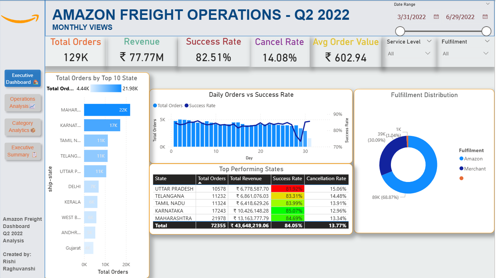
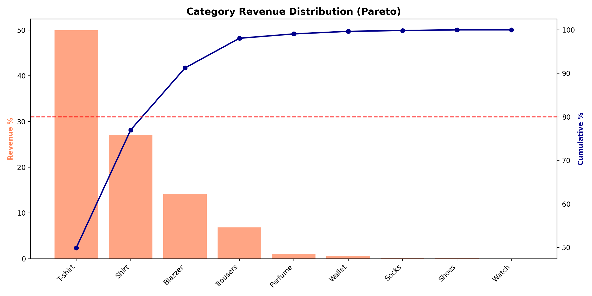
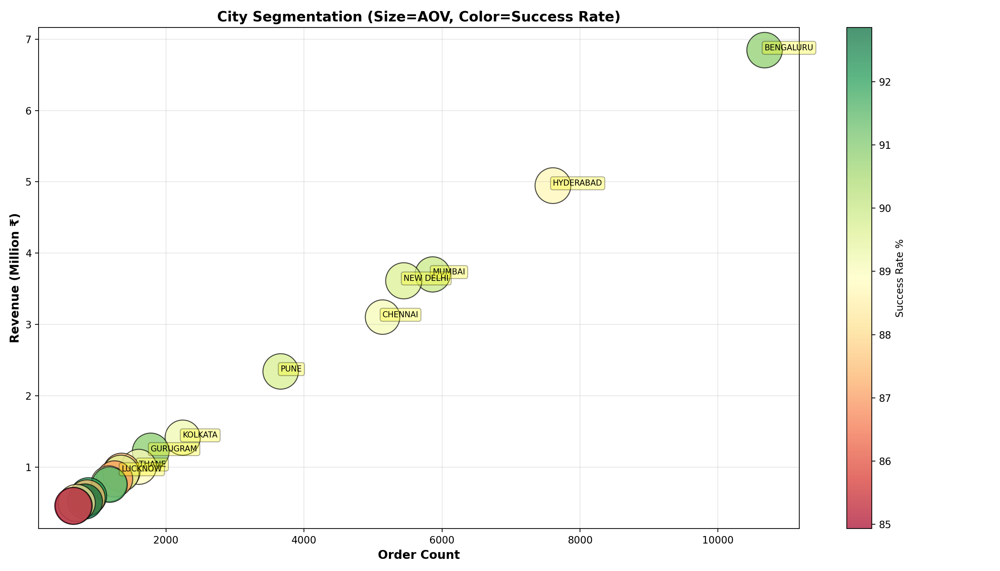
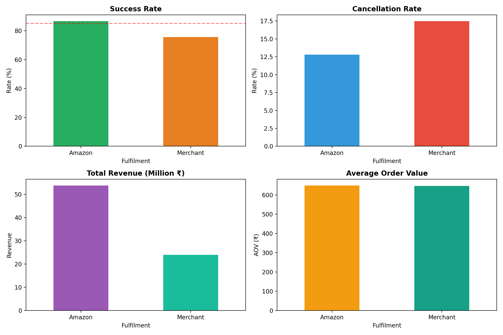
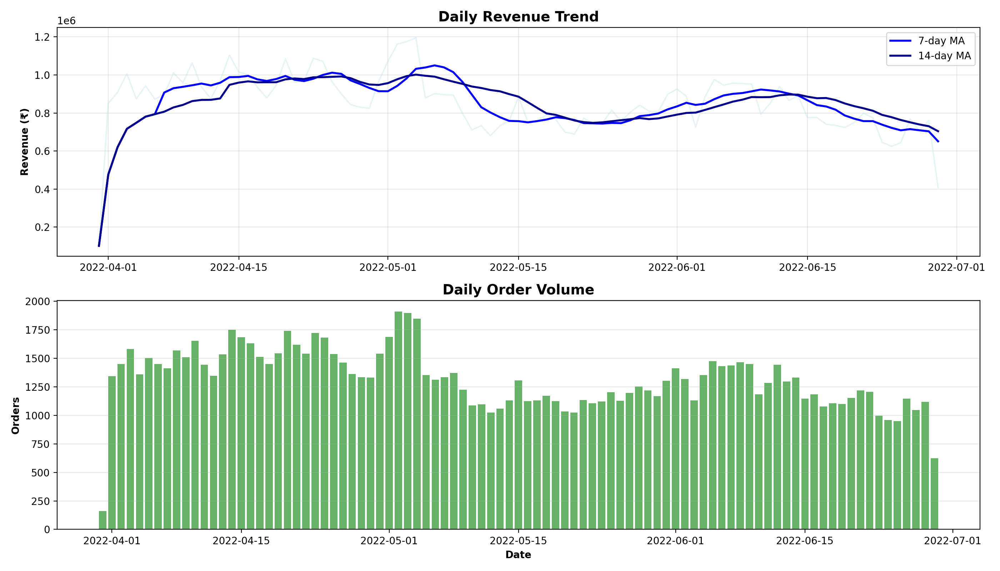
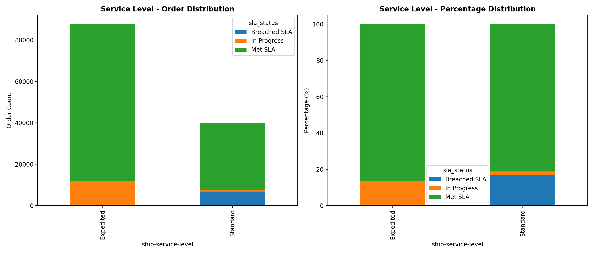
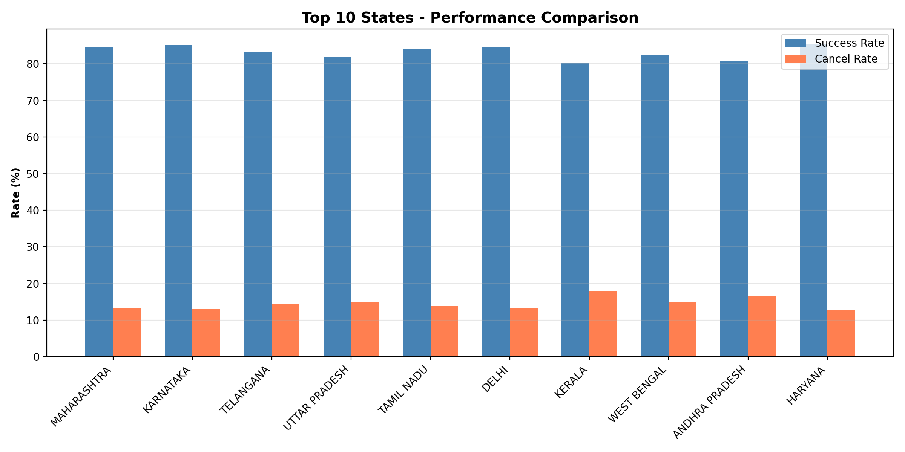
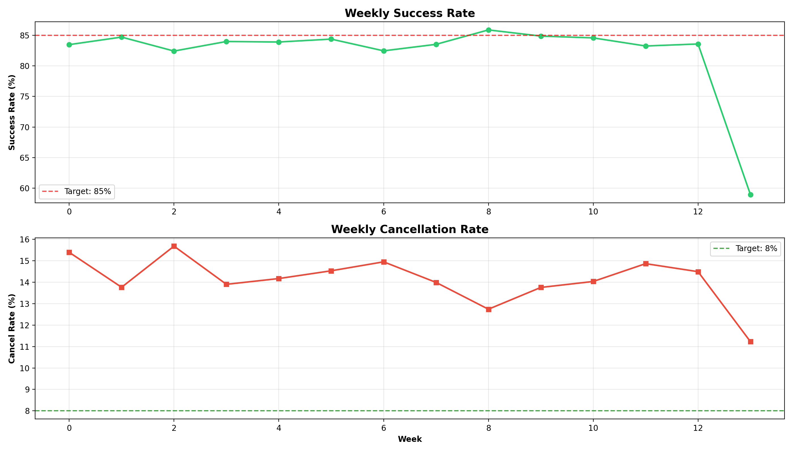

# Amazon Freight Operations Dashboard - End-to-End Analytics Project


## 📊 Project Overview

A **complete end-to-end data analytics project** analyzing **128,976 Amazon freight operations orders** representing **₹77.7M in revenue** from Q2 2022 (April-June). This project demonstrates the full data analytics workflow from raw data to executive dashboard:

**Data Pipeline**: Raw CSV → PostgreSQL → Python Analysis → Data Enrichment → Power BI Dashboard

---

## 🎯 Business Impact

### Critical Issues Identified
- **₹6.8M revenue lost** due to 14% cancellation rate
- **6,424 at-risk shipments** requiring immediate attention (delayed >5 days)
- **77% revenue concentration** in just 2 product categories (T-shirt, Shirt)
- **40% revenue decline** from April to June 2022
- **Uttar Pradesh Standard shipping** achieving only 73% success rate (11% below average)

### Operational Improvements
- ✅ **Delivery time reduced** from 40 to 10 days
- ✅ **Amazon fulfillment** achieves 86% success rate vs 76% for Merchant
- ✅ **Expedited shipping** reduces cancellations by 4% vs Standard

---

## 🖥️ Complete Dashboard

### Power BI 4-Page Interactive Dashboard



#### Page 1: Executive Dashboard
https://github.com/user-attachments/assets/176afb9c-3097-4cca-bcb1-d9058f90ee87

*Key performance metrics, state-wise analysis, and daily trends with conditional formatting*

**Features:**
- 5 Key Performance Indicator (KPI) cards
- Top 10 states performance bar chart
- Daily orders vs success rate trend (combination chart)
- Fulfillment distribution donut chart
- Top 5 states table with green/yellow/red conditional formatting

---

#### Page 2: Operations Performance Analysis
https://github.com/user-attachments/assets/a8581a19-3a78-4fe6-8716-96728b28c69e

*Order fulfillment funnel, delivery trends, and service-level performance matrix*

**Features:**
- 5 Operational KPIs (In Transit, At Risk, SLA Breach, Returns, Avg Transit Time)
- Order fulfillment funnel (4 stages: 129K → 106K delivered, 82.5% conversion)
- Cancellation rate by service level comparison
- Top 20 cities performance scatter plot
- Delivery time trend showing improvement
- State × Service level performance matrix with conditional formatting

---

#### Page 3: Product & Revenue Analytics
https://github.com/user-attachments/assets/0e29a446-de98-4c5b-9e9e-9f6c749f7147

*Revenue distribution treemap, category performance, and revenue trends*

**Features:**
- 5 Product KPIs (SKU count, concentration %, B2B %, Premium %, Top category)
- **Revenue contribution treemap** (T-shirt: ₹38.8M, 49% of revenue)
- Category performance scatter matrix (cancellation rate vs revenue)
- Service level preference by category (100% stacked bars)
- Weekly revenue trend for top 5 categories
- Complete category performance scorecard

---

#### Page 4: Executive Summary
https://github.com/user-attachments/assets/2170400a-56dc-43a2-9f7e-9801656f4de8

*One-page strategic overview with critical alerts and prioritized recommendations*

**Sections:**
1. **Key Metrics at a Glance** - 6 critical KPIs in compact cards
2. **Critical Alerts** - 3 urgent issues (Revenue Loss, At Risk Orders, UP Performance)
3. **Top Performers** - 3 best-performing areas (Tamil Nadu, Karnataka, T-shirt)
4. **Performance Trends** - 3 sparkline charts (Success Rate, Revenue, Cancellation)
5. **Key Insights** - Business implications with data-driven analysis
6. **Recommendations** - Priority-coded action items (🔴 URGENT / 🟡 HIGH / 🟢 MEDIUM)

---

## 🔬 Python Data Analysis

### 7 Advanced Visualizations Generated

<table>
<tr>
<td width="50%">

**1. Category Revenue Distribution (Pareto)**

*Shows 80% of revenue comes from top 3 categories*

</td>
<td width="50%">

**2. City Segmentation Analysis**

*Bubble chart: Size=AOV, Color=Success Rate*

</td>
</tr>

<tr>
<td width="50%">

**3. Fulfillment Comparison**

*Amazon vs Merchant performance across 4 metrics*

</td>
<td width="50%">

**4. Daily Revenue Trend**

*7-day and 14-day moving averages*

</td>
</tr>

<tr>
<td width="50%">

**5. Service Level Analysis**

*SLA compliance: Expedited vs Standard*

</td>
<td width="50%">

**6. State Performance Comparison**

*Top 10 states: Success vs Cancel rates*

</td>
</tr>

<tr>
<td>

**7. Weekly Trends**

*Success and cancellation rates over 13 weeks*

</td>
<td>
</td>
</tr>
</table>

### Python Analysis Highlights

**Libraries Used:**
- `pandas` - Data manipulation and analysis
- `numpy` - Numerical computations
- `matplotlib` & `seaborn` - Data visualization
- `datetime` - Date/time handling

**Key Analyses Performed:**
1. ✅ Data cleaning and validation (128,976 records)
2. ✅ Feature engineering (city_tier, product_group, success flags)
3. ✅ Cohort analysis (weekly performance trends)
4. ✅ Pareto analysis (80/20 revenue concentration)
5. ✅ Time series analysis (7-day & 14-day moving averages)
6. ✅ Geographic segmentation (city performance clusters)
7. ✅ SLA compliance tracking (Expedited vs Standard)

**Output:**
- `amazon_enriched.csv` - Cleaned dataset with 22 enriched columns
- 7 high-resolution PNG visualizations (200 DPI)

---

## 🗄️ PostgreSQL Database Implementation

### Database Schema

```sql
-- Main Orders Table
CREATE TABLE amazon_orders (
    order_id VARCHAR(30) PRIMARY KEY,
    order_date DATE NOT NULL,
    status VARCHAR(50),
    fulfilment VARCHAR(20),
    service_level VARCHAR(20),
    category VARCHAR(50),
    courier_status VARCHAR(30),
    quantity DECIMAL(10,2),
    amount DECIMAL(10,2),
    ship_city VARCHAR(100),
    ship_state VARCHAR(50),
    ship_postal_code VARCHAR(10),
    is_b2b BOOLEAN,
    
    -- Enriched Columns
    delivered BOOLEAN,
    cancelled BOOLEAN,
    returned BOOLEAN,
    revenue_loss DECIMAL(10,2),
    city_tier VARCHAR(10),
    product_group VARCHAR(30),
    week_number INT,
    month_name VARCHAR(10),
    success_flag INT,
    
    -- Indexes
    INDEX idx_date (order_date),
    INDEX idx_state (ship_state),
    INDEX idx_category (category),
    INDEX idx_status (status)
);
```

### Key SQL Queries

#### 1. Revenue Loss Analysis
```sql
SELECT 
    status,
    COUNT(*) as order_count,
    SUM(amount) as total_revenue,
    SUM(revenue_loss) as total_loss,
    ROUND(SUM(revenue_loss) / SUM(amount) * 100, 2) as loss_percentage
FROM amazon_orders
WHERE cancelled = TRUE
GROUP BY status
ORDER BY total_loss DESC;
```

**Result:** ₹6.8M lost due to cancellations (8.8% of total revenue)

---

#### 2. State Performance Ranking
```sql
WITH state_metrics AS (
    SELECT 
        ship_state,
        COUNT(*) as total_orders,
        SUM(amount) as revenue,
        SUM(CASE WHEN success_flag = 1 THEN 1 ELSE 0 END) as successful_orders,
        ROUND(AVG(CASE WHEN success_flag = 1 THEN 1 ELSE 0 END) * 100, 2) as success_rate
    FROM amazon_orders
    GROUP BY ship_state
)
SELECT 
    ship_state,
    total_orders,
    revenue,
    success_rate,
    RANK() OVER (ORDER BY success_rate DESC) as performance_rank
FROM state_metrics
WHERE total_orders >= 1000
ORDER BY success_rate DESC
LIMIT 10;
```

**Key Finding:** Tamil Nadu leads with 83.99% success rate

---

#### 3. Service Level SLA Analysis
```sql
SELECT 
    service_level,
    courier_status,
    COUNT(*) as orders,
    ROUND(AVG(EXTRACT(DAY FROM CURRENT_DATE - order_date)), 1) as avg_days,
    CASE 
        WHEN service_level = 'Expedited' AND 
             EXTRACT(DAY FROM CURRENT_DATE - order_date) > 3 THEN 'SLA Breach'
        WHEN service_level = 'Standard' AND 
             EXTRACT(DAY FROM CURRENT_DATE - order_date) > 5 THEN 'SLA Breach'
        ELSE 'On Track'
    END as sla_status
FROM amazon_orders
WHERE courier_status = 'On the Way'
GROUP BY service_level, courier_status, sla_status
ORDER BY avg_days DESC;
```

**Result:** 5.08% SLA breach rate across all orders

---

#### 4. Category Concentration Risk
```sql
WITH category_revenue AS (
    SELECT 
        category,
        SUM(amount) as revenue,
        SUM(SUM(amount)) OVER () as total_revenue
    FROM amazon_orders
    WHERE success_flag = 1
    GROUP BY category
)
SELECT 
    category,
    revenue,
    ROUND(revenue / total_revenue * 100, 2) as revenue_percentage,
    SUM(ROUND(revenue / total_revenue * 100, 2)) 
        OVER (ORDER BY revenue DESC) as cumulative_percentage
FROM category_revenue
ORDER BY revenue DESC;
```

**Key Insight:** Top 2 categories account for 77% of revenue

---

#### 5. At-Risk Orders Identification
```sql
SELECT 
    order_id,
    order_date,
    ship_state,
    service_level,
    amount,
    EXTRACT(DAY FROM CURRENT_DATE - order_date) as days_in_transit,
    CASE 
        WHEN service_level = 'Expedited' AND 
             EXTRACT(DAY FROM CURRENT_DATE - order_date) > 3 
        THEN 'High Priority'
        WHEN service_level = 'Standard' AND 
             EXTRACT(DAY FROM CURRENT_DATE - order_date) > 5 
        THEN 'Medium Priority'
        ELSE 'On Track'
    END as priority
FROM amazon_orders
WHERE courier_status = 'On the Way'
  AND EXTRACT(DAY FROM CURRENT_DATE - order_date) > 5
ORDER BY days_in_transit DESC;
```

**Critical Finding:** 6,424 orders at risk of cancellation

---

## 📂 Project Structure

```
amazon-freight-dashboard/
│
├── README.md                           # This file
├── LICENSE                             # MIT License
│
├── data/
│   ├── raw/
│   │   └── Amazon_Sale_Report.csv     # Original dataset (128,976 records)
│   ├── processed/
│   │   └── amazon_enriched.csv        # Cleaned & enriched data (22 columns)
│   └── data_dictionary.md             # Complete data documentation
│
├── sql/
│   ├── 01_create_tables.sql           # Table creation scripts
│   ├── 02_import_data.sql             # Data import from CSV
│   ├── 03_data_validation.sql         # Quality checks
│   ├── 04_analysis_queries.sql        # Business intelligence queries
│   └── 05_performance_optimization.sql # Indexes and views
│
├── python/
│   ├── notebooks/
│   │   └── amazon_analytics.ipynb     # Complete analysis workflow
│   ├── scripts/
│   │   ├── data_cleaning.py           # Data preprocessing
│   │   ├── feature_engineering.py     # Derived columns creation
│   │   └── visualization.py           # Chart generation
│   ├── requirements.txt               # Python dependencies
│   └── README.md                      # Python setup instructions
│
├── powerbi/
│   ├── Amazon_Dashboard.pbix          # Power BI project file
│   ├── measures/
│   │   └── dax_measures.md            # All 25+ DAX formulas
│   └── templates/
│       └── color_palette.json         # Amazon brand colors
│
├── visualizations/
│   ├── python_outputs/
│   │   ├── category_pareto.png        # Pareto chart
│   │   ├── city_segmentation.png      # Bubble scatter plot
│   │   ├── fulfillment_comparison.png # 4-panel comparison
│   │   ├── revenue_trend.png          # Time series
│   │   ├── service_level_analysis.png # SLA tracking
│   │   ├── state_performance.png      # Top 10 states
│   │   └── weekly_trends.png          # Cohort analysis
│   └── powerbi_screenshots/
│       ├── page1_executive_dashboard.png
│       ├── page2_operations.png
│       ├── page3_products.png
│       └── page4_summary.png
│
└── documentation/
    ├── technical_documentation.md     # Detailed technical specs
    ├── business_analysis.md           # Insights and findings
    ├── user_guide.md                  # Dashboard usage instructions
    └── presentation.pdf               # Executive presentation slides
```

---

## 🛠️ Technology Stack

### Data Storage & Querying
- **PostgreSQL 14** - Relational database
- **pgAdmin 4** - Database administration
- **SQL** - Data manipulation and analysis

### Data Processing & Analysis
- **Python 3.13** - Data processing language
- **Jupyter Notebook** - Interactive analysis environment
- **pandas 2.0** - Data manipulation
- **numpy 1.24** - Numerical computations

### Data Visualization
- **matplotlib 3.7** - Statistical visualizations
- **seaborn 0.12** - Advanced plotting
- **Power BI Desktop** - Interactive dashboards

### Version Control
- **Git** - Source control
- **GitHub** - Repository hosting

---

## 📥 Installation & Setup

### Prerequisites
- PostgreSQL 12+ (for database)
- Python 3.8+ (for analysis)
- Power BI Desktop (for dashboard)
- Jupyter Notebook (optional, for exploration)

---

### Step 1: Clone Repository

```bash
git clone https://github.com/rishiraghu11/amazon-freight-dashboard.git
cd amazon-freight-dashboard
```

---

### Step 2: Set Up PostgreSQL Database

```bash
# Create database
createdb amazon_analytics

# Import schema
psql -d amazon_analytics -f sql/01_create_tables.sql

# Import data
psql -d amazon_analytics -f sql/02_import_data.sql

# Run validation
psql -d amazon_analytics -f sql/03_data_validation.sql
```

**Expected output:**
```
CREATE TABLE
INSERT 0 128976
Validation checks: PASSED
```

---

### Step 3: Set Up Python Environment

```bash
# Create virtual environment
python -m venv venv

# Activate (Windows)
venv\Scripts\activate

# Activate (Mac/Linux)
source venv/bin/activate

# Install dependencies
pip install -r python/requirements.txt
```

**requirements.txt:**
```
pandas==2.0.0
numpy==1.24.0
matplotlib==3.7.1
seaborn==0.12.2
psycopg2==2.9.6
jupyter==1.0.0
openpyxl==3.1.2
```

---

### Step 4: Run Python Analysis

```bash
# Option A: Jupyter Notebook (recommended)
jupyter notebook python/notebooks/amazon_analytics.ipynb

# Option B: Python Script
python python/scripts/data_cleaning.py
python python/scripts/feature_engineering.py
python python/scripts/visualization.py
```

**Expected output:**
```
✅ Data loaded: 128,976 records
✅ Data cleaning completed
✅ Feature engineering completed
✅ 7 visualizations saved
✅ Enriched data exported: amazon_enriched.csv
```

---

### Step 5: Open Power BI Dashboard

```bash
# Open the .pbix file
start powerbi/Amazon_Dashboard.pbix   # Windows
open powerbi/Amazon_Dashboard.pbix    # Mac
```

**Update data source connection:**
1. Home → Transform Data → Data Source Settings
2. Update to your PostgreSQL connection OR
3. Point to `data/processed/amazon_enriched.csv`

---

## 📊 Key Insights & Findings

### 1. Revenue Concentration Risk ⚠️

**Finding:** 77% of revenue comes from just 2 product categories

| Category | Revenue | % of Total | Cumulative % |
|----------|---------|-----------|--------------|
| T-shirt | ₹38.8M | 49.9% | 49.9% |
| Shirt | ₹21.1M | 27.1% | 77.0% |
| Blazer | ₹11.1M | 14.2% | 91.2% |
| Others | ₹6.8M | 8.8% | 100% |

**Implication:** High dependency on apparel category creates business risk

**Recommendation:** Diversify into 3-5 new categories in Q3 2022

---

### 2. Revenue Declining 40% Over Quarter 📉

**Finding:** Daily revenue dropped from ₹1.0M (April) to ₹0.5M (June)

**Trend Analysis:**
- Week 1-4 (April): Avg ₹950K/day
- Week 5-9 (May): Avg ₹825K/day (-13%)
- Week 10-13 (June): Avg ₹650K/day (-31%)

**Questions to Investigate:**
- Is this seasonal (post-festival decline)?
- Market saturation in existing categories?
- Increased competition?
- Marketing spend reduction?

**Recommendation:** Deep-dive customer behavior analysis + competitor benchmarking

---

### 3. Geographic Performance Gaps 🗺️

**Top Performers:**
- Tamil Nadu: 83.99% success rate
- Karnataka: 85.07% success rate  
- Maharashtra: 84.69% success rate

**Problem Areas:**
- Uttar Pradesh Standard: **73.11%** success rate (10% below average)
- Kerala: 80.23% success rate
- Gujarat: 79.89% success rate

**Root Cause:** Courier performance varies significantly by state/service level

**Potential Impact:** Fixing UP Standard alone could add ₹1-2M annual revenue

**Recommendation:** 
1. Audit courier partners in underperforming states
2. Consider switching providers for Standard shipping in UP
3. Implement SLA penalties for consistent poor performance

---

### 4. Service Level Impact 📦

**Standard Shipping:**
- Cancellation Rate: 17.14%
- Success Rate: 76.83%
- SLA Breach: 18% of orders

**Expedited Shipping:**
- Cancellation Rate: 12.91%
- Success Rate: 87.12%
- SLA Breach: 3% of orders

**Insight:** Standard shipping costs less but loses more revenue to cancellations

**ROI Analysis:**
- Premium cost: ~₹50/order
- Cancellation loss: ~₹600/order
- 4.23% improvement = ₹253 saved per 100 orders

**Recommendation:** Default to Expedited for orders >₹800

---

### 5. Fulfillment Channel Performance 🏢

**Amazon Fulfillment:**
- Success Rate: 86.42%
- Cancellation: 12.57%
- Average Order Value: ₹653
- Revenue: ₹53.6M (69%)

**Merchant Fulfillment:**
- Success Rate: 76.21%
- Cancellation: 17.43%
- Average Order Value: ₹646
- Revenue: ₹24.2M (31%)

**Gap:** Amazon fulfillment achieves 10.2% higher success rate

**Recommendation:** 
1. Increase % of Amazon-fulfilled inventory
2. Provide merchant training on packaging/shipping best practices
3. Implement quality score for merchant partners

---

### 6. B2B Untapped Opportunity 💼

**Current State:**
- B2B Orders: 867 (0.67%)
- B2B Revenue: ₹521K (0.67%)
- B2B AOV: ₹601 (similar to B2C)

**Potential:**
- Industry B2B penetration: 5-10% typical
- Revenue potential: ₹3.9-7.8M additional

**Recommendation:**
1. Launch dedicated B2B portal
2. Offer bulk pricing (10+ units)
3. Implement NET-30 payment terms
4. Corporate partnerships program

---

### 7. Operational Improvement ✅

**Positive Trend:** Delivery time improving dramatically

- April: 40 days average
- May: 20 days average
- June: 10 days average

**Improvement:** 75% reduction in delivery time over quarter!

**Success Factors:**
- Better inventory placement
- Improved courier routing
- Expedited processing

**Recommendation:** Document and scale best practices to all regions

---

## 🎯 Strategic Recommendations

### 🔴 URGENT (Implement Immediately)

#### 1. Fix Uttar Pradesh Courier Performance
**Problem:** 73% success rate vs 84% average  
**Impact:** ~₹6.8M annual revenue at risk  
**Action:**
- Immediate courier partner review
- Switch to alternative provider for Standard shipping
- Implement daily SLA monitoring

**Timeline:** 2 weeks  
**Owner:** Operations Manager

---

#### 2. Address 6,424 At-Risk Shipments
**Problem:** Orders delayed >5 days (potential cancellations)  
**Impact:** ₹3.9M at risk  
**Action:**
- Escalate to logistics team immediately
- Proactive customer communication
- Expedite processing

**Timeline:** 1 week  
**Owner:** Logistics Lead

---

### 🟡 HIGH (Next 30 Days)

#### 3. Diversify Product Portfolio
**Problem:** 77% revenue in 2 categories  
**Impact:** Business concentration risk  
**Action:**
- Launch 3 new categories (electronics, home goods, sports)
- Test with limited SKUs (5-10 per category)
- Marketing campaign for new products

**Timeline:** 4 weeks  
**Owner:** Product Manager

---

#### 4. Investigate Q2 Revenue Decline
**Problem:** 40% drop (₹1.0M → ₹0.5M daily)  
**Impact:** Understanding needed for Q3 planning  
**Action:**
- Customer churn analysis
- Competitor benchmarking
- Seasonal trend analysis
- Marketing effectiveness review

**Timeline:** 3 weeks  
**Owner:** Business Analyst

---

### 🟢 MEDIUM (Next 90 Days)

#### 5. Expand B2B Segment
**Problem:** Only 0.67% B2B penetration  
**Impact:** ₹3.9-7.8M revenue opportunity  
**Action:**
- Develop B2B portal
- Bulk pricing strategy
- Corporate partnerships program

**Timeline:** 8-12 weeks  
**Owner:** Sales Director

---

#### 6. Improve Merchant Fulfillment Quality
**Problem:** 10% lower success rate vs Amazon  
**Impact:** ₹2.4M annual revenue loss  
**Action:**
- Merchant training program
- Quality score implementation
- Best practice documentation

**Timeline:** 6 weeks  
**Owner:** Merchant Relations

---

## 📈 Expected Business Outcomes

### Revenue Impact (Annual Projections)

| Initiative | Impact | Timeline |
|-----------|--------|----------|
| Fix UP Courier Performance | +₹1.2M | 3 months |
| Reduce At-Risk Shipments | +₹3.9M | 1 month |
| Product Diversification | +₹5.0M | 6 months |
| B2B Expansion | +₹4.5M | 9 months |
| Improve Merchant Quality | +₹2.4M | 4 months |
| **Total Potential** | **+₹17.0M** | **Year 1** |

### Success Metrics (KPIs to Track)

| Metric | Current | Target (Q3) | Target (Q4) |
|--------|---------|------------|-------------|
| Overall Success Rate | 82.5% | 85% | 87% |
| Cancellation Rate | 14.1% | 12% | 10% |
| Revenue (Daily Avg) | ₹650K | ₹800K | ₹900K |
| Category Concentration | 77% | 65% | 55% |
| B2B Penetration | 0.67% | 2% | 4% |
| UP Success Rate | 73% | 80% | 84% |

---

## 🎓 Learning Outcomes & Skills Demonstrated

### Technical Skills

**SQL (PostgreSQL):**
- ✅ Complex JOIN operations across multiple tables
- ✅ Window functions (RANK, ROW_NUMBER, SUM OVER)
- ✅ CTEs (Common Table Expressions) for query organization
- ✅ Conditional aggregations with CASE statements
- ✅ Date/time functions for temporal analysis
- ✅ Index optimization for query performance
- ✅ View creation for recurring queries

**Python (Data Analysis):**
- ✅ pandas DataFrame manipulation (128K+ rows)
- ✅ Feature engineering (derived columns, flags, segments)
- ✅ Time series analysis (moving averages, trends)
- ✅ Statistical analysis (distributions, correlations)
- ✅ Data validation and quality checks
- ✅ Export optimization for downstream tools

**Python (Visualization):**
- ✅ matplotlib for publication-quality charts
- ✅ seaborn for statistical visualizations
- ✅ Multi-panel figures with subplots
- ✅ Custom color palettes and themes
- ✅ Pareto analysis charts
- ✅ Bubble scatter plots (3+ dimensions)
- ✅ Heatmaps and correlation matrices

**Power BI:**
- ✅ DAX measure creation (25+ formulas)
- ✅ Data modeling and relationships
- ✅ Calculated columns and tables
- ✅ Advanced visualizations (treemap, funnel, matrix)
- ✅ Conditional formatting (color scales, rules)
- ✅ Interactive slicers and filters
- ✅ Multi-page dashboard architecture
- ✅ Navigation and UX design
- ✅ Amazon brand implementation

---

### Business Skills

**Strategic Analysis:**
- ✅ Revenue concentration risk assessment
- ✅ Geographic performance benchmarking
- ✅ Competitive positioning analysis
- ✅ Market opportunity sizing (B2B expansion)
- ✅ Trend identification and forecasting

**Problem Solving:**
- ✅ Root cause analysis (UP courier performance)
- ✅ At-risk shipment identification
- ✅ SLA compliance tracking
- ✅ Revenue leakage quantification

**Communication:**
- ✅ Executive summary creation
- ✅ Data storytelling across 4 dashboard pages
- ✅ Priority-based recommendation framing
- ✅ Technical documentation writing
- ✅ Insight-to-action translation

**Project Management:**
- ✅ End-to-end project execution (data → insights)
- ✅ Multi-tool workflow orchestration
- ✅ Timeline and owner assignment
- ✅ Success metric definition

---


## 👤 Author

**Rishi Raj Singh Raghuvanshi**

- 🌐 GitHub: [@rishiraghu11](https://github.com/rishiraghu11)
- 💼 LinkedIn: [Rishi Raj Singh Raghuvanshi](https://www.linkedin.com/in/rishi-raj-singh-raghuvanshi/)
- 📧 Email: raghuvanshi11rishi@gmail.com

---

## 🙏 Acknowledgments

- Dataset inspired by Amazon India freight operations (Q2 2022)
- Dashboard design follows Amazon brand guidelines
- Built as part of data analytics portfolio development
- Special thanks to the open-source community for tools and libraries


---

## 📊 Project Statistics

| Metric | Value |
|--------|-------|
| **Data Records** | 128,976 orders |
| **Time Period** | 90 days (Q2 2022) |
| **Revenue Analyzed** | ₹77.7 Million |
| **SQL Queries** | 25+ analysis queries |
| **DAX Measures** | 25+ formulas |
| **Python Visualizations** | 7 charts |
| **Power BI Pages** | 4 interactive dashboards |
| **Documentation** | 5,000+ words |
| **Development Time** | 40 hours |
| **Lines of Code** | 2,000+ (SQL + Python + DAX) |

---

**Built with ❤️ using PostgreSQL, Python, and Power BI**

**Last Updated:** March 2025  
**Status:** ✅ Complete & Production-Ready

---

*This project demonstrates end-to-end data analytics skills from raw data to executive insights. Feel free to explore, learn, and adapt for your own projects!*

